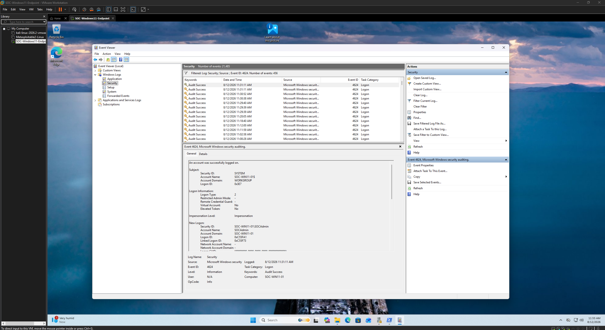
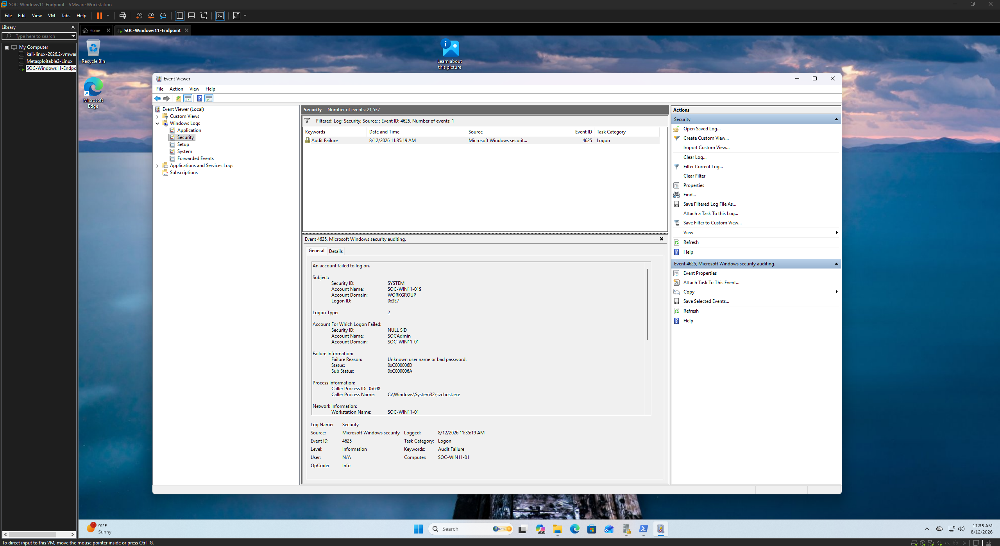

# Authentication Analysis Evidence

This directory documents the monitoring and analysis of Windows authentication activity within the SOC monitoring lab.

Windows Security auditing was configured to capture both successful and failed authentication attempts. Controlled authentication activity was then generated and reviewed through Windows Event Viewer to validate that the endpoint produced usable security telemetry.

## Events Analyzed

| Event ID | Description | Investigation Use |
|----------|-------------|-------------------|
| 4624 | Successful Logon | Identify successful authentication activity |
| 4625 | Failed Logon | Identify unsuccessful authentication attempts |

## Evidence

### 07 — Successful Interactive Logon

Windows Security Event ID **4624** confirmed a successful interactive authentication to the monitored endpoint.

The event provided useful investigative context including:

- Account name: `SOCAdmin`
- Endpoint/domain context
- Logon type
- Logon ID
- Authentication timestamp

The observed **Logon Type 2** identified the event as an interactive logon to the Windows endpoint.

This telemetry can help a SOC analyst establish when an account successfully accessed a system and correlate that access with subsequent endpoint activity.

---

### 08 — Failed Interactive Logon

Windows Security Event ID **4625** captured a controlled failed authentication attempt.

The event provided additional investigative context including:

- Targeted account
- Account domain
- Logon type
- Failure reason
- Status and sub-status codes
- Originating workstation

The event recorded the failure reason as an invalid username or password condition, providing an example of the telemetry available when authentication is unsuccessful.

## Analysis

Reviewing successful and failed authentication events together allows an analyst to distinguish normal access from authentication failures and identify patterns requiring further investigation.

Examples of potentially noteworthy behavior could include:

- Repeated failed authentication attempts
- Failures followed by a successful logon
- Unexpected account usage
- Authentication occurring at unusual times
- Logons followed by suspicious process execution

In this lab, the authentication events were generated intentionally in a controlled environment to validate the monitoring configuration and practice Windows event analysis.

## Investigation Value

Authentication telemetry provides an important starting point for endpoint investigations.

Event IDs 4624 and 4625 can help answer questions such as:

- Which account attempted to authenticate?
- Was authentication successful?
- What type of logon occurred?
- When did the activity occur?
- What endpoint generated the event?

These authentication events were later reviewed alongside process creation telemetry during the event-correlation portion of the project.
