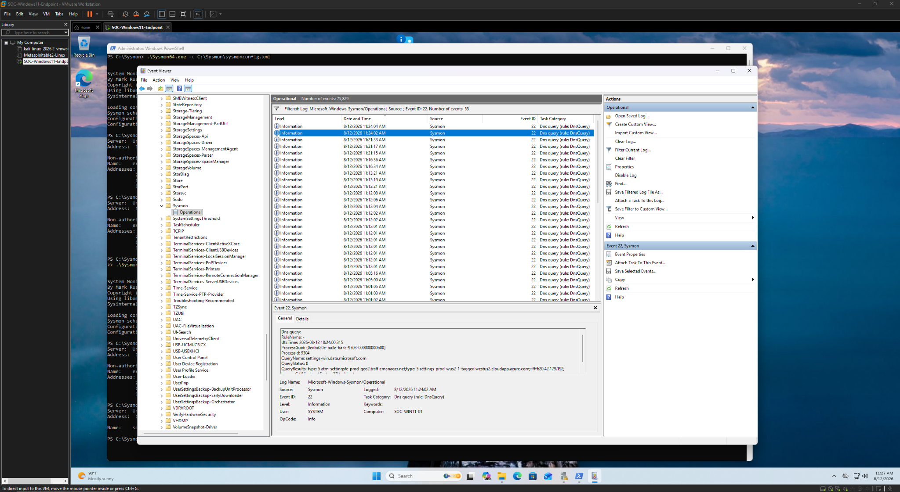

# DNS Analysis Evidence

This directory documents DNS query monitoring and analysis using Sysmon within the Windows SOC monitoring lab.

Sysmon DNS telemetry was validated through the `Microsoft-Windows-Sysmon/Operational` event log. DNS activity generated by processes on the endpoint was recorded as **Sysmon Event ID 22** and reviewed through Windows Event Viewer.

## Event Analyzed

| Event ID | Source | Description | Investigation Use |
|----------|--------|-------------|-------------------|
| 22 | Sysmon | DNS Query | Associate DNS activity with processes on the endpoint |

## Evidence

### 06 — Sysmon DNS Query Logging

Sysmon Event ID **22** confirms that DNS query telemetry was successfully being collected from the Windows 11 endpoint.

DNS events can provide investigative context including:

- Queried domain name
- Process responsible for the query
- Process ID
- Query status
- Returned DNS results
- User context
- Timestamp

This allows an analyst to associate network-related activity with the process responsible for generating it.

## Analysis

DNS telemetry can provide valuable context during endpoint investigations because domain lookups often occur before a system communicates with a remote service.

When combined with process telemetry, DNS events can help analysts determine not only **which domain was queried**, but also **which executable initiated the request**.

Potentially noteworthy activity could include:

- Queries to unexpected or unfamiliar domains
- Repeated DNS requests from unusual processes
- DNS activity associated with suspicious command execution
- Domain lookups occurring shortly after an unusual authentication event

A DNS query by itself does not establish malicious activity. The event should be evaluated alongside process, authentication, and other endpoint telemetry.

## Investigation Value

Sysmon Event ID 22 provides an additional source of endpoint visibility beyond native Windows Security auditing.

During this lab, DNS telemetry was successfully observed on the monitored Windows 11 endpoint, demonstrating that Sysmon could associate DNS activity with endpoint processes.

This telemetry complements the authentication and process evidence collected elsewhere in the project and provides another data source that can be incorporated into SOC event correlation.
