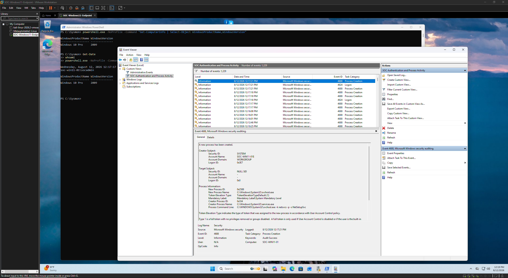

# Event Correlation Evidence

This directory documents the correlation of Windows authentication and process telemetry during the SOC monitoring investigation.

After validating individual authentication and process creation events, a custom Windows Event Viewer view was created to consolidate security-relevant activity into a single investigative workspace.

## Events Correlated

| Event ID | Source | Description | Investigation Use |
|----------|--------|-------------|-------------------|
| 4624 | Windows Security | Successful Logon | Establish successful account access |
| 4625 | Windows Security | Failed Logon | Identify unsuccessful authentication attempts |
| 4688 | Windows Security | Process Creation | Identify processes executed on the endpoint |

Reviewing these events together allows an analyst to establish a timeline and identify relationships between authentication activity and subsequent process execution.

## Evidence

### 12 — SOC Custom Event Correlation View

A custom Windows Event Viewer view was created to consolidate Event IDs **4624, 4625, and 4688** into a single investigative workspace.

Rather than reviewing each event type independently, the custom view allows authentication and process activity to be examined chronologically.

This provides a more efficient method for identifying relationships between events during endpoint triage.

## Correlation Workflow

A simplified investigation sequence can be represented as:

**Authentication Attempt → Successful Logon → Process Execution → Analyst Review**

For example, an analyst could:

1. Identify failed authentication attempts through Event ID 4625.
2. Determine whether a successful authentication followed using Event ID 4624.
3. Review Event ID 4688 for processes executed after the successful logon.
4. Compare timestamps, account information, and process details.
5. Use additional Sysmon telemetry when deeper process or DNS context is required.

## Analysis

Individual Windows events provide useful information, but their investigative value increases when they are analyzed together.

A failed logon may be routine user error. A successful logon may represent expected activity. A PowerShell process may be legitimate administration.

However, a sequence of unusual authentication attempts followed by successful access and unexpected process execution could warrant further investigation.

Correlation therefore helps an analyst evaluate **context and sequence**, rather than treating individual events as isolated indicators.

## Investigation Value

The custom Event Viewer view demonstrates a basic SOC triage workflow using native Windows telemetry.

It provides a centralized location for reviewing:

- Authentication failures
- Successful authentication
- Process execution
- Event timestamps
- User activity

Sysmon process and DNS telemetry collected elsewhere in this project can then provide additional context when an event sequence requires deeper investigation.

This demonstrates how multiple endpoint telemetry sources can be combined to reconstruct activity and support an evidence-based security assessment.
