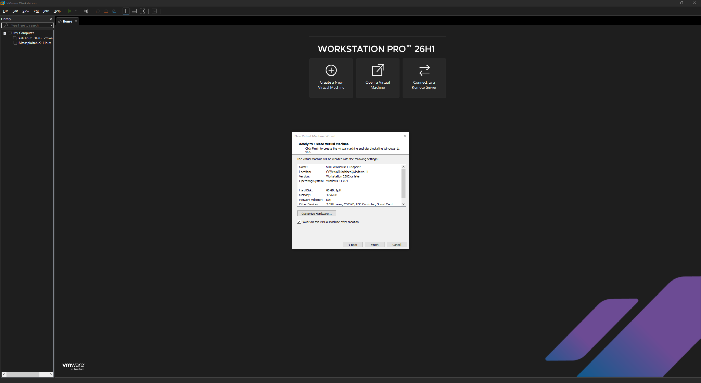
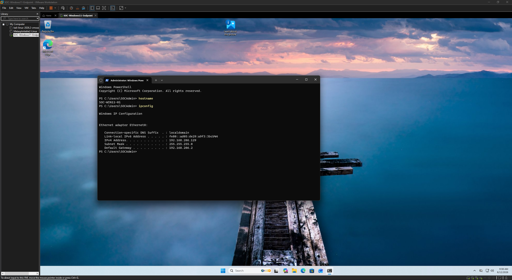
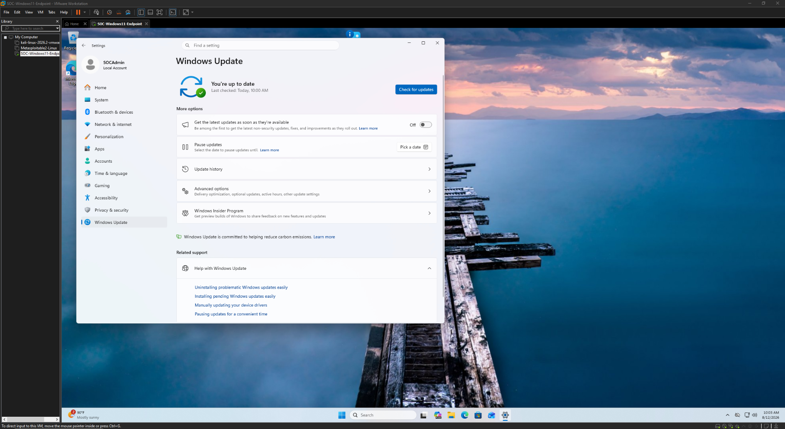
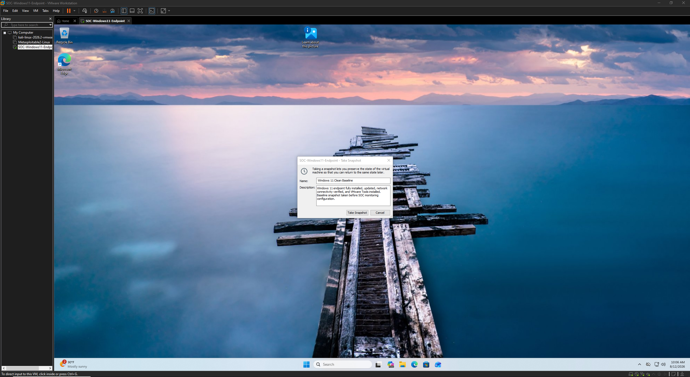

# Lab Setup Evidence

This directory documents the baseline Windows endpoint and virtualized environment used for the SOC monitoring lab.

The environment was built as an isolated platform for configuring Windows security auditing, collecting endpoint telemetry, generating controlled activity, and performing security event analysis and correlation.

## Environment

- **Endpoint:** Windows 11
- **Hostname:** `SOC-WIN11-01`
- **Virtualization:** VMware Workstation
- **Monitoring:** Windows Security Event Logging and Sysmon
- **Analysis:** Windows Event Viewer and PowerShell
- **Purpose:** Controlled endpoint telemetry generation and SOC investigation

## Evidence

### 01 — Windows 11 Virtual Machine Configuration

Documents the virtual machine configuration used for the Windows 11 monitoring endpoint.

---

### 02 — Endpoint Network Configuration

Documents the endpoint hostname and network configuration within the isolated virtual lab environment.

---

### 03 — Windows Update Baseline

Confirms that the Windows 11 endpoint was updated before security monitoring and investigation activities were performed.

---

### 04 — Clean Baseline Snapshot

Documents the clean virtual machine snapshot created before additional SOC monitoring configuration and controlled testing.

## Lab Design

Establishing a known baseline provides a consistent starting point for security monitoring exercises. The clean snapshot allows the endpoint to be returned to a known state, while the isolated virtual environment provides a controlled platform for generating and analyzing security telemetry.

This environment served as the foundation for the logging configuration, authentication analysis, process monitoring, DNS analysis, and event-correlation activities documented throughout this repository.
