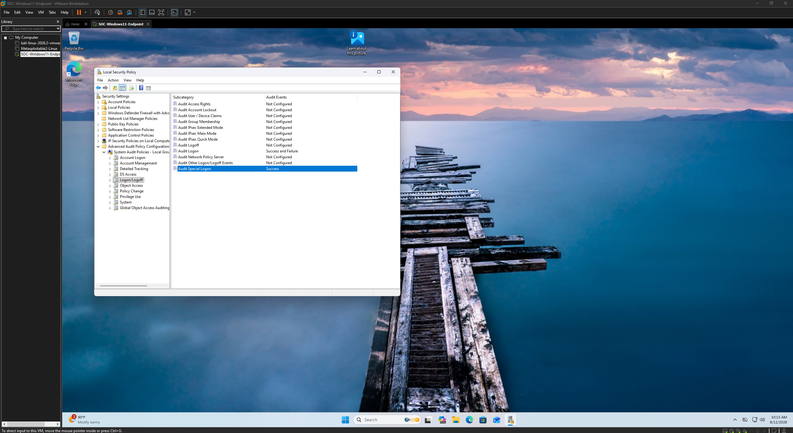
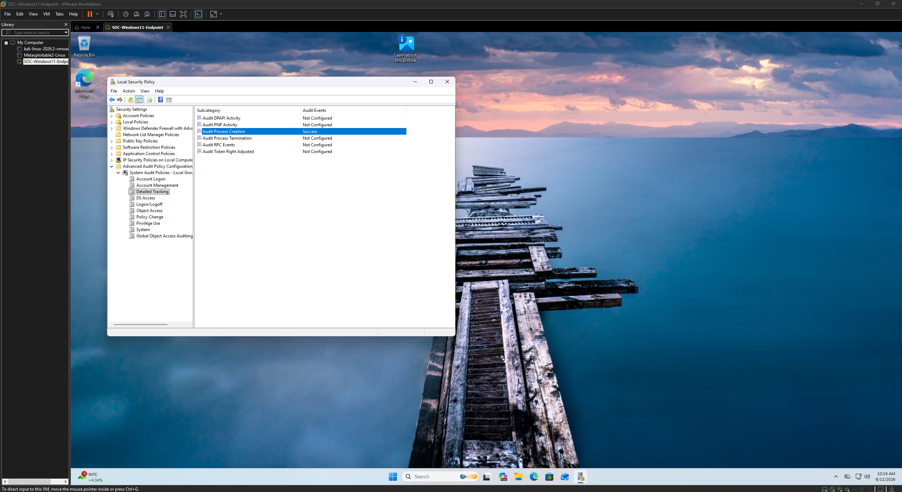
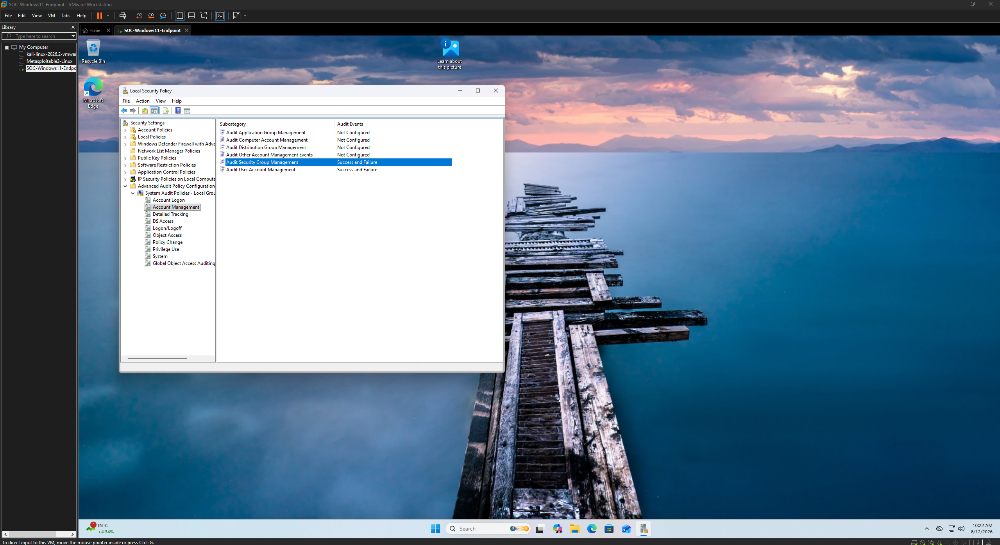
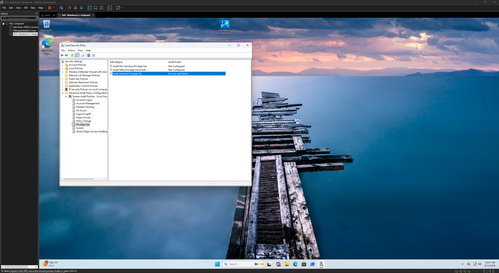
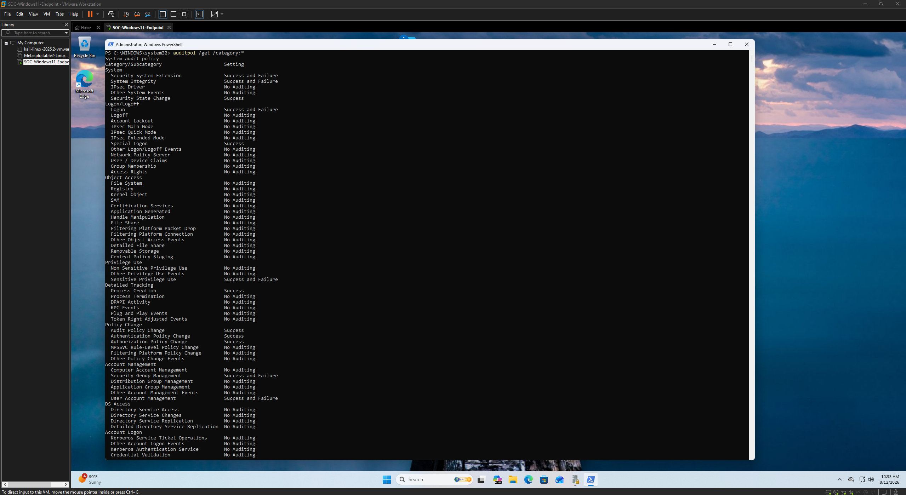

# Logging Configuration Evidence

This directory documents the Windows auditing configuration implemented on the monitored endpoint to provide security-relevant telemetry for the SOC investigation.

Windows Advanced Audit Policy was configured to increase visibility into authentication, process execution, account management, policy changes, privilege use, and system activity.

The resulting Security log telemetry was later supplemented by Sysmon for enhanced endpoint visibility.

## Logging Objectives

The auditing configuration was designed to provide visibility into:

- Authentication and special logon activity
- Process creation
- Account management
- Security policy changes
- Sensitive privilege use
- System-level security events

These telemetry sources provide the foundation for the authentication, process, and event-correlation analysis performed later in the lab.

## Evidence

### 05 — Special Logon Auditing

Documents the Windows Advanced Audit Policy configuration used to capture special logon activity.

Special logon events can help identify sessions in which elevated privileges or administrative capabilities are assigned to an account.

---

### 06 — Process Creation Auditing

Documents the configuration of process creation auditing.

Process creation telemetry is particularly valuable during endpoint investigations because it allows analysts to identify programs executed on the system and correlate their activity with other security events.

---

### 07 — Account Management Auditing

Documents the auditing configuration for account-management activity.

This telemetry can provide visibility into security-relevant changes involving local users, groups, and account configuration.

---

### 08 — Policy Change Auditing

Documents the configuration of security policy change auditing.

Monitoring policy changes can help identify modifications to security controls or audit settings that may affect endpoint visibility.

---

### 09 — Sensitive Privilege Use Auditing

Documents the auditing configuration for sensitive privilege use.

Privilege-use telemetry provides additional context when investigating administrative or elevated activity on a Windows endpoint.

---

### 10 — System Auditing

Documents the system-level auditing configuration used to capture security-relevant operating system activity.

System auditing contributes additional context for endpoint monitoring and investigation.

---

### 11 — Audit Policy Verification

Provides command-line verification of the resulting Windows Advanced Audit Policy configuration.

This final validation confirms that the intended auditing categories were enabled before controlled activity was generated and analyzed.

## Monitoring Foundation

The configured audit policies established the native Windows telemetry required for the investigation.

The lab subsequently used Windows Security events such as:

| Event ID | Description | Investigation Use |
|----------|-------------|-------------------|
| 4624 | Successful Logon | Identify successful authentication activity |
| 4625 | Failed Logon | Identify unsuccessful authentication attempts |
| 4688 | Process Creation | Analyze executed processes and command-line activity |

Sysmon was used alongside native Windows auditing to provide additional process and DNS telemetry.

Together, these logging sources created the endpoint visibility used throughout the remaining SOC analysis.
