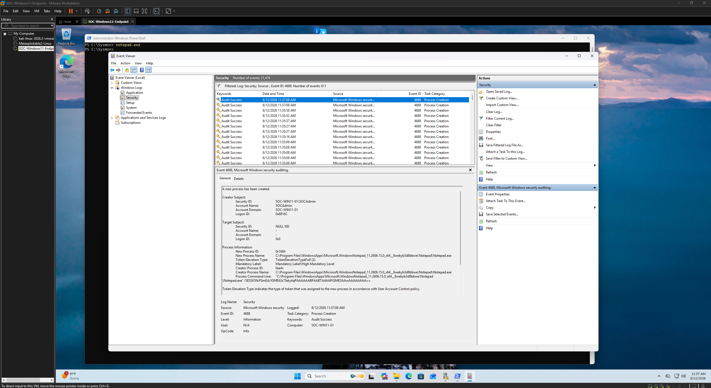
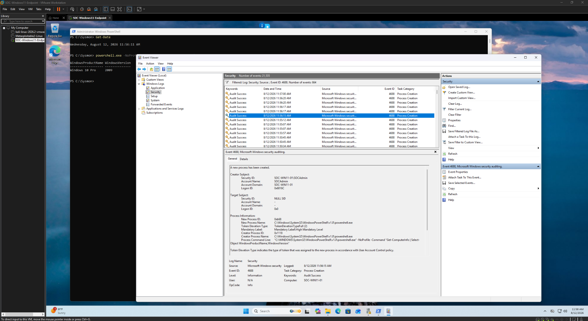
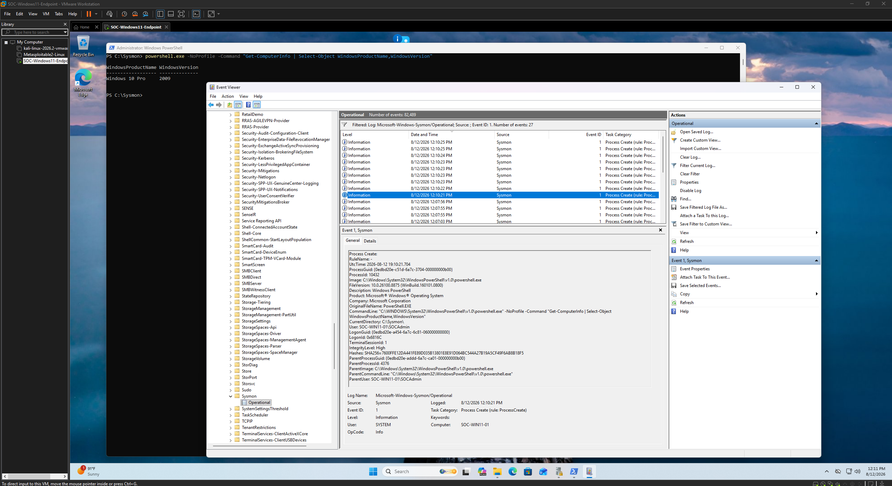

# Process Analysis Evidence

This directory documents process monitoring and command-line analysis performed using native Windows Security auditing and Sysmon.

Process creation auditing was enabled on the Windows 11 endpoint to provide visibility into programs and commands executed by users. Sysmon supplemented the native Windows telemetry with additional process context.

## Events Analyzed

| Event ID | Source | Description | Investigation Use |
|----------|--------|-------------|-------------------|
| 4688 | Windows Security | Process Creation | Identify processes executed on the endpoint |
| 1 | Sysmon | Process Create | Analyze enhanced process and command-line telemetry |

## Evidence

### 09 — Windows Process Creation Event

Windows Security Event ID **4688** records the creation of a new process.

Process creation events provide valuable investigative context such as:

- New process name
- Creator/parent process
- User context
- Process ID
- Command-line information when configured

This telemetry allows an analyst to reconstruct programs and utilities executed during a user session.

---

### 10 — PowerShell Process Creation

A controlled PowerShell execution was captured through Windows Security Event ID **4688**.

PowerShell activity is particularly useful to monitor because it is a legitimate administrative tool that can also appear during suspicious endpoint activity.

Rather than treating PowerShell execution alone as malicious, analysts can examine its command-line arguments, user context, parent process, timestamp, and surrounding events to determine whether the activity is expected.

---

### 11 — Sysmon PowerShell Process Creation

Sysmon Event ID **1** captured enhanced process creation telemetry associated with PowerShell activity.

Compared with native Windows process auditing, Sysmon provides additional investigative context that can include:

- Process image
- Command line
- Parent process
- User context
- Process identifiers
- Cryptographic hashes

The presence of this event also validates that Sysmon telemetry was successfully being collected on the monitored endpoint.

## Analysis

Using Windows Security and Sysmon together provides complementary visibility into endpoint process activity.

Windows Event ID 4688 establishes that a process was created through native auditing, while Sysmon Event ID 1 can provide additional detail useful for investigation and correlation.

This allows an analyst to move beyond simply identifying that a program executed and instead examine the context surrounding its execution.

## Investigation Value

Process telemetry can help answer questions such as:

- What program was executed?
- Which account executed it?
- What process launched it?
- What command-line arguments were used?
- When did execution occur?
- Does the process correspond with authentication or network activity?

In this lab, controlled process activity was generated intentionally to validate the monitoring configuration and practice reconstructing endpoint activity from multiple telemetry sources.

The resulting process events were later incorporated into the event-correlation portion of the investigation.
